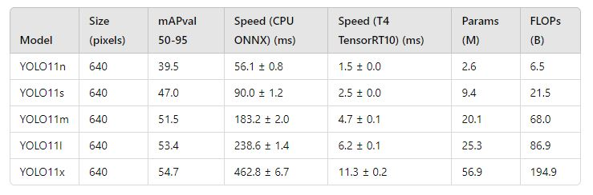

# YOLOv11 C++ TensorRT


<a href="https://github.com/hamdiboukamcha/Yolo-V11-cpp-TensorRT" style="margin: 0 2px;">
    
</a>

<a href="https://github.com/yourusername/YOLOv11-TensorRT/blob/main/LICENSE" style="margin: 0 2px;">
    
</a>

## 📜 Citation

The **YOLOv11 C++ TensorRT Project** is a high-performance object detection solution implemented in **C++** and optimized using **NVIDIA TensorRT**. This project leverages the YOLOv11 model to deliver fast and accurate object detection, utilizing TensorRT to maximize inference efficiency and performance.

---

## 📢 Updates

### Key Features:
- **Model Conversion**: Convert ONNX models to TensorRT engine files to accelerate inference.
- **Inference on Videos**: Efficiently perform object detection on video files.
- **Inference on Images**: Execute object detection on individual images.
- **High Efficiency**: Optimized for real-time object detection using NVIDIA GPUs.
- **Preprocessing with CUDA**: CUDA-enabled preprocessing for faster input handling.



---
## 📂 Project Structure
  
    YOLOv11-TensorRT/
    ├── CMakeLists.txt          # Build configuration for the project
    ├── include/                # Header files
    ├── src/
    │   ├── main.cpp            # Main entry point for the application
    │   ├── yolov11.cpp         # YOLOv11 implementation
    │   └── preprocess.cu       # CUDA preprocessing code
    ├── assets/                 # Images and benchmarks for README
    └── build/                  # Compiled binaries

## 🛠️ Setup

### Prerequisites

- **CMake** (version 3.18 or higher)
- **TensorRT** (V8.6.1.6: For optimized inference with YOLOv11.)
- **CUDA Toolkit** (V11.7: For GPU acceleration)
- **OpenCV** (V4.10.0: For image and video processing)
- **NVIDIA GPU** (with compute capability 7.5 or higher)

### Installation

1. Clone the repository:
   ```bash
   git clone https://github.com/hamdiboukamcha/Yolo-V11-cpp-TensorRT.git
   cd YOLOv11-TensorRT
2. Update the TensorRT and OpenCV paths in CMakeLists.txt:
   ```bash
   set(TENSORRT_PATH "F:/Program Files/TensorRT-8.6.1.6")  # Adjust this to your path

4. Build the project:
    ```bash
    mkdir build
    cd build
    cmake ..
    make -j$(nproc)
## 🚀 Usage

### Convert Yolov11 To ONNX Model
    from ultralytics import YOLO
    Load the YOLO model
    model = YOLO("yolo11s.pt")
    #Export the model to ONNX format
    export_path = model.export(format="onnx")

### Convert ONNX Model to TensorRT Engine

To convert an ONNX model to a TensorRT engine file, use the following command:

    ./YOLOv11TRT convert path_to_your_model.onnx path_to_your_engine.engine.
        
path_to_your_model.onnx: Path to the ONNX model file.

path_to_your_engine.engine: Path where the TensorRT engine file will be saved.

### Run Inference on Video
To run inference on a video, use the following command:

    ./YOLOv11TRT infer_video path_to_your_video.mp4 path_to_your_engine.engine

path_to_your_video.mp4: Path to the input video file.

path_to_your_engine.engine: Path to the TensorRT engine file.

### Run Inference on Video
Run Inference on Image
To run inference on an image, use the following command:

    ./YOLOv11TRT infer_image path_to_your_image.jpg path_to_your_engine.engine
    
path_to_your_image.jpg: Path to the input image file.

path_to_your_engine.engine: Path to the TensorRT engine file.

## ⚙️ Configuration

### CMake Configuration
In the CMakeLists.txt, update the paths for TensorRT and OpenCV if they are installed in non-default locations:

#### Set the path to TensorRT installation

    #Define the path to TensorRT installation
    set(TENSORRT_PATH "F:/Program Files/TensorRT-8.6.1.6")  # Update this to the actual path for TensorRT
    
Ensure that the path points to the directory where TensorRT is installed.

### Troubleshooting
Cannot find nvinfer.lib: Ensure that TensorRT is correctly installed and that nvinfer.lib is in the specified path. Update CMakeLists.txt to include the correct path to TensorRT libraries.

Linker Errors: Verify that all dependencies (OpenCV, CUDA, TensorRT) are correctly installed and that their paths are correctly set in CMakeLists.txt.

Run-time Errors: Ensure that your system has the correct CUDA drivers and that TensorRT runtime libraries are accessible. Add TensorRT’s bin directory to your system PATH.

## 📞 Contact

For advanced inquiries, feel free to contact me on LinkedIn: <a href="https://www.linkedin.com/in/hamdi-boukamcha/" target="_blank"> </a>

## 📜 Citation

If you use this code in your research, please cite the repository as follows:

        @misc{boukamcha2024yolov11,
            author = {Hamdi Boukamcha},
            title = {Yolo-V11-cpp-TensorRT},
            year = {2024},
            publisher = {GitHub},
            howpublished = {\url{https://github.com/hamdiboukamcha/Yolo-V11-cpp-TensorRT/}},
        }


  


